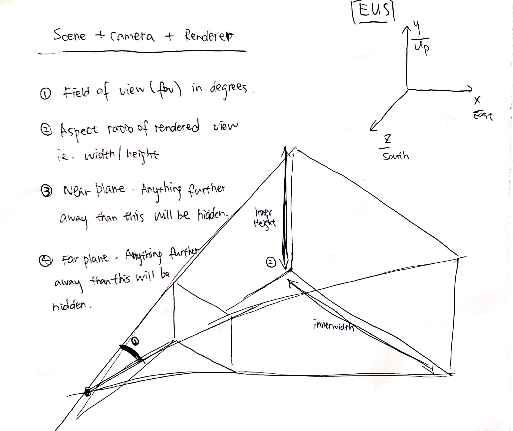
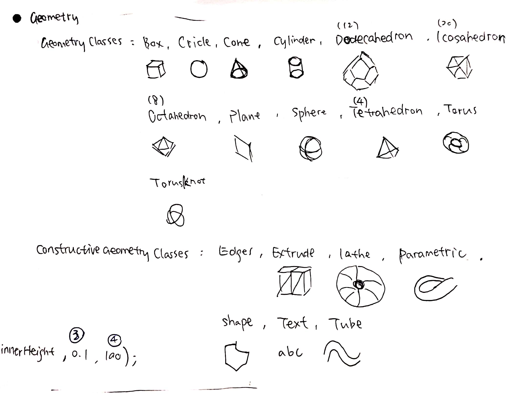
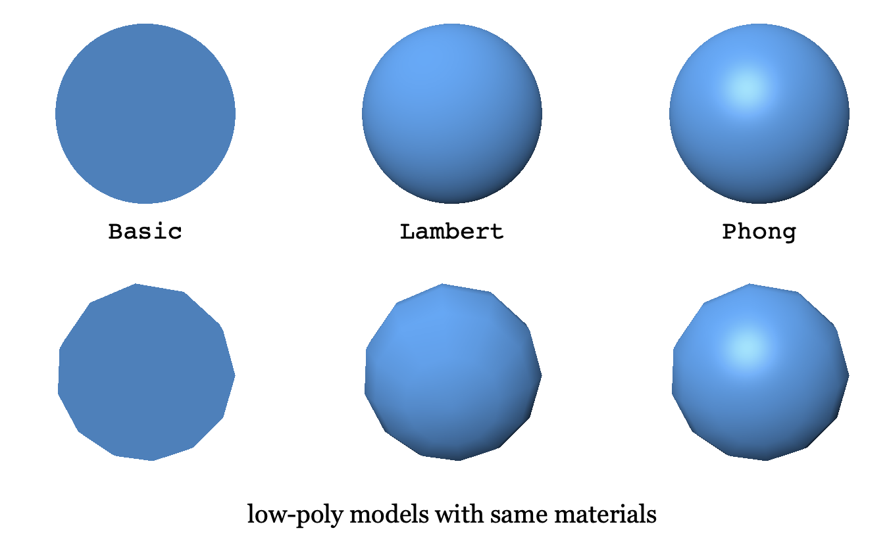
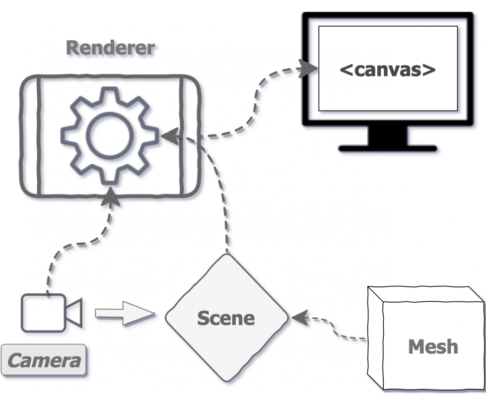
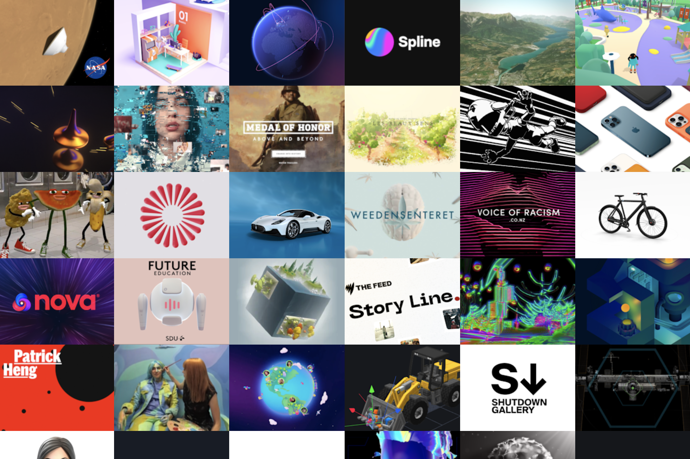

SI579 Final Project

Chen Chen

**Notes:**

Please open [the website](https://e477n.studio/react-gh-pages/index.html) using Chrome, Safari is not supported.


### Project Topic

**Anti-Asian attack cases**

Use interactive 3d object to engage audiences. They can view individual reported cases thus arise awareness of the current situation. 


### Functions

- enter the scene and change camera position through scrolling
- click in each mesh to view corresponding attack cases
- go to external website to view more details


### Used Libraries

- react three fiber
- react three drei
- three.js (to extend when components not available through react three fiber)
- virtual-scroll
- react bootstrap

## Library Introduction

### Three.js

- a 3D library that tries to make it as easy as possible to get 3D content on a webpage
- uses WebGL to draw 3D
- handles stuff like scenes, lights, shadows, materials, textures, 3d math

#### Structure of a Three.js app

an app = Scene + Camera + Renderer

Scene = Mesh + Light + other objects

Mesh = Geometry + Material

Texture can be applied to Material


##### Frustum: to determine what is inside the camera's field of view.

- keep near and far in a sensible range for your scene




##### Objects visible in a Three.js scene

- mesh
- line segments
- particles


#### Geometry

```
var cubeGeometry = new THREE.CubeGeometry(20, 20, 20, 2, 2, 2);
```

(Width, height, depth, width segments to 2, .., ..)



#### Materials

- The [`MeshBasicMaterial`](https://threejs.org/docs/#api/en/materials/MeshBasicMaterial) is not affected by lights. 
  - roughness 0 to 1
  - metalness from 0 to 1

- The [`MeshLambertMaterial`](https://threejs.org/docs/#api/en/materials/MeshLambertMaterial) computes lighting only at the vertices 

- the [`MeshPhongMaterial`](https://threejs.org/docs/#api/en/materials/MeshPhongMaterial) which computes lighting at every pixel




#### Lights

- PointLight
- AmbientLight
- DirectionalLight


#### Loaders

- import external 3D models into the app

- GLTFLoader.load(url, onload, onProgress, onError)
  - const loader = new GLTFLoader();
  - loader.load(url, onload function)

- Supported 3d file formats: gltf, glb, obj, fbx, 3ds, ...


#### Reference

- https://threejsfundamentals.org/threejs/lessons/threejs-fundamentals.html
- https://threejsfundamentals.org/threejs/lessons/threejs-materials.html
- https://threejs.org/docs/#examples/en/loaders/GLTFLoader


### React Three Fiber

a powerful Three.js renderer that helps render 3D models and animations for React and its native applications

- component based scene
- Built-in hooks
  - useFrame: attach functions into requestAnimationFrame()
  - useThree: get useful objects like renderer, scene, camera


#### Basic terms

1. **Canvas**: The canvas object is used to draw graphics on your scene. It is similar to a real canvas which is used to draw paintings on. It only renders Three.js elements and not DOM elements.
2. **Scene**: It's just like in a movie with actors, actresses and environments on a single screen, but not bounded by time frames, it holds all 3D objects on the screen.
3. **Camera**: A viewer that allows you to look at all surroundings and objects in the scene.
4. **Object3d**: Most of the things like the camera, scenes, mesh, lights etc. are derived from this base class in Three.js. This class provides a set of properties and methods for manipulating objects in the 3D space.



#### reference

- https://geekyants.com/blog/introduction-to-react-three-fiber


### Virtual Scroll

- "Zoom" by scrolling
  - Zooming: changing the field of view
  - **Dollying: moving the camera forwards and backwards**

- create custom scrollers with touch and keyboard support

  - Use method instance.on(callback, context) to get

    - ```
      y, // total distance scrolled on the y axis
      ```

  - change the camera position in useFrame()

#### Reference

- https://www.npmjs.com/package/virtual-scroll


## Useful Resources

1. React Three Fiber official https://github.com/pmndrs/react-three-fiber
2. Three.js https://threejs.org
3. Youtube channel Yuri Artyukh https://www.youtube.com/channel/UCDo7RTzizoOdPjY8A-xDR7g

